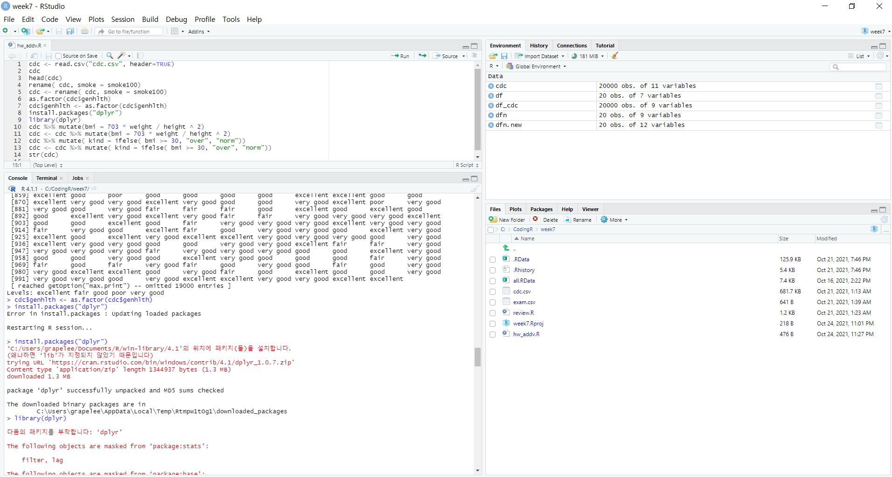

# 한림대학교 소프트웨어융합대학
---

이수진
---

소속: 자연과학대학
전공: 청각학과

관심분야 
*생물정보학
**인공지능**
*의료정보학

프로그램 언어 스킬
1. c
2. Java
3. Python
4. R

--------

2020년도 1학기 강의 과목
|과목|내용|학점|
|---|---|---|
|c 프로그래밍|c 언어 개요|3|
|Java 프로그래밍|java 개용|3|
|소프트웨어세미나1|최신 소프트웨어 트랜드|1|

github address: [L-SJin][github]

[github]:http://github.com/L-SJin
